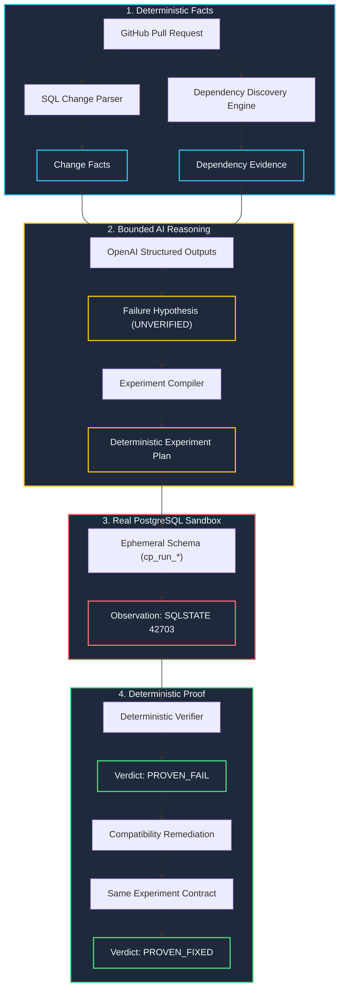

# ChangeProof

> **Don't predict the failure. Reproduce it before production.**  
> *Fix it, run the same experiment again, and prove the result.*

[](https://changeproof-web-production.up.railway.app)
[](https://changeproof-api-production.up.railway.app/api/v1/health)
[-brightgreen?style=for-the-badge&logo=githubactions)](https://github.com/choi11000/ChangeProof/actions)
[](docs/technical-proof.md)

ChangeProof is an **Executable Change Verification Agent** (증거 기반 실행형 변경 검증 에이전트).  
It turns database schema migrations in GitHub pull requests into deterministic facts, unchanged application dependency evidence, evidence-grounded AI failure hypotheses, isolated PostgreSQL sandbox reproductions (`PROVEN_FAIL`), and same-experiment compatibility remediation proofs (`PROVEN_FIXED`).

---

## 🎯 Try the Live Demo in 30 Seconds

* **Public Web Service**: [https://changeproof-web-production.up.railway.app](https://changeproof-web-production.up.railway.app)
* **Official Demo PR**: [choi11000/changeproof-demo#1](https://github.com/choi11000/changeproof-demo/pull/1)

### How to Run:
1. Open the [Live Web Service](https://changeproof-web-production.up.railway.app).
2. Click **'Live Demo 실행하기'** (or **'Run Live Demo'** in English); the configured demo analysis starts immediately.
3. Review the `Proof Summary`, detected `DROP_COLUMN orders.legacy_status` fact, cross-layer dependency evidence in `app/order_service.py:11`, and the AI failure hypothesis.
4. Click **'격리된 PostgreSQL에서 실험 실행 →'** (`Run experiment in isolated PostgreSQL`) to witness actual database execution failure (`SQLSTATE 42703 • undefined_column`) $\rightarrow$ **`PROVEN_FAIL`**.
5. Click **'복구 검증 →'** (`Verify remediation`) to run the **exact same experiment contract** against compatibility-remediated code $\rightarrow$ **`PROVEN_FIXED`**.

---

## ⚠️ The Problem: The Diff-Only Blindspot

Modern code reviews and predictive AI code reviewers commonly answer:
* *"What changed in this PR?"*
* *"Does this look risky based on general patterns?"*

**However, they cannot prove:**
* *"Will this specific schema change break an unchanged application query at runtime?"*

```text
PR Migration Diff:
+ ALTER TABLE orders DROP COLUMN legacy_status;

Unchanged Application Source (NOT in the PR diff):
  order_dict = {"id": order.id, "status": order.legacy_status}  <-- RUNTIME CRASH!
```

Diff-only review can miss unchanged application dependencies, while speculative AI reviewers can only generate probabilistic risk signals without runtime observation.

---

## 💡 How ChangeProof Works: From Guesswork to Proof

ChangeProof replaces speculation with **reproduction**:

1. **Deterministic Fact Extraction**: Parses SQL migrations with an AST parser (`sqlglot`) and scans the entire repository tree at the PR commit (`head_sha`) to discover references to dropped columns or tables.
2. **Evidence-Grounded AI Planning**: Uses OpenAI Structured Outputs to propose concrete failure hypotheses and an allowlisted experiment template from verified facts and evidence. Hypotheses remain strictly `UNVERIFIED`; a deterministic compiler creates the executable 6-step plan.
3. **Ephemeral PostgreSQL Execution**: Spawns an isolated ephemeral schema (`cp_run_<hex12>`), applies baseline schemas, loads seed data, applies the PR migration, and executes the dependent query. It captures physical database engine errors (`SQLSTATE 42703`) $\rightarrow$ **`PROVEN_FAIL`**.
4. **Same-Experiment Remediation Proof**: Applies a backward-compatible remediation migration and re-executes the identical experiment contract digest (`contract_...`) against a changed subject. When the previously observed failure disappears (`PROVEN_PASS`), the deterministic verifier issues **`PROVEN_FIXED`** for that before/after experiment pair.

---

## 🛡️ The 4-Layer Trust Model

| Layer | Responsibility | Engine / Component | Trust Level | Output |
| :--- | :--- | :--- | :--- | :--- |
| **1. FACT** | SQL parsing & source dependency discovery | `sqlglot` AST & file indexer | 100% Deterministic | `ChangeFact`, `DependencyEvidence` |
| **2. HYPOTHESIS** | Failure symptom & experiment plan mapping | OpenAI `gpt-4o-mini` (Structured Outputs) | Bounded AI reasoning | `FailureHypothesis` (`UNVERIFIED`) |
| **3. OBSERVATION** | Sandbox migration & query execution | Ephemeral PostgreSQL 17 (`psycopg`) | Real DB Engine | `SQLSTATE 42703`, Step traces |
| **4. VERDICT & PROOF** | Contract digest & invariance verification | Deterministic proof verifier | 100% Deterministic | `PROVEN_FAIL`, `PROVEN_FIXED` |

> **Crucial Boundary**: AI **never** decides whether a change is safe and never executes arbitrary SQL or shell commands. PostgreSQL supplies observations; the deterministic verifier alone issues verdicts.

```text
DETERMINISTIC ANALYSIS = FACT
OPENAI = HYPOTHESIS
POSTGRESQL = OBSERVATION
DETERMINISTIC VERIFIER = VERDICT

SAME EXPERIMENT
- CHANGED SUBJECT
- FAIL → PASS
= PROOF
```

`PROVEN_PASS` means the expected failure was not observed in that controlled experiment. It does not establish that the entire pull request or production system is safe.

> This proof applies to this controlled experiment, not to the entire pull request or production system.

---

## 🏛️ System Architecture



---

## 📦 Implemented Scope & Roadmap

### Implemented Verticals
* **Database Schema Changes**: PostgreSQL DDL migrations (`DROP_COLUMN`, `DROP_TABLE`, `ALTER_COLUMN_TYPE`, `NOT NULL`, `DEFAULT`). Deterministic `sqlglot` AST parsing, cross-layer application code dependency discovery, ephemeral schema sandbox execution, exact `SQLSTATE 42703` observation, and `PROVEN_FAIL` → `PROVEN_FIXED` remediation proof.
* **API Contract Changes**: OpenAPI 3.x specifications (`openapi.yaml`, `openapi.yml`, `openapi.json`). Deterministic base-vs-head diffing for `REMOVE_RESPONSE_FIELD`, consumer client dependency discovery (`response["field"]`), in-process Starlette ASGI controlled runtime, exact `API_MISSING_RESPONSE_FIELD` observation, and same-experiment compatibility remediation proof.
* **Source & Pull Requests**: GitHub public repositories and pull requests with exact demo authorization guardrails.
* **Security & Isolation**: Zero arbitrary repository execution (no `npm/pip install`, no shell/subprocess, no external network egress).

### Future Roadmap (PLANNED)
* **Supply-chain behavioral proof** (process, network, filesystem isolation) — *FUTURE*
* **Event & Message Schema breaking changes** (Kafka, Protobuf, Avro) — *FUTURE*
* **Infrastructure & Configuration contract validation** — *FUTURE*
* **Additional Database engines** (MySQL, SQLite) — *FUTURE*

---

## 💻 Local Development

Prerequisites: Docker Desktop with Compose v2, Python 3.11+, Node.js 20+.

```bash
# 1. Clone repository
git clone https://github.com/choi11000/ChangeProof.git
cd ChangeProof

# 2. Configure environment
cp .env.example .env

# 3. Start API, Web, and Sandbox PostgreSQL
docker compose --profile sandbox up --build -d
```

Access:
* Web UI: `http://localhost:3000`
* API Docs: `http://localhost:8000/docs`
* API Health: `http://localhost:8000/api/v1/health`

To run automated tests:
```bash
# Backend pytest suite (176 tests, 94.9% coverage)
cd apps/api && pytest -v --cov=app

# Frontend Vitest suite (6 tests)
cd ../web && npm test
```

---

## 📑 Documentation

* [Wanted AI Championship 2026 Submission Document](docs/wanted-submission.md)
* [Submission Checklist](docs/wanted-submission-checklist.md)
* [Technical Proof Sheet](docs/technical-proof.md)
* [Architecture & Trust Model](docs/architecture-submission.md)
* [100-Second Demo Video Script](docs/demo-video-script.md)
* [Release Freeze Declaration](docs/release-freeze.md)
* [TOP20 Demo Day Outline](docs/demo-day-outline.md)
