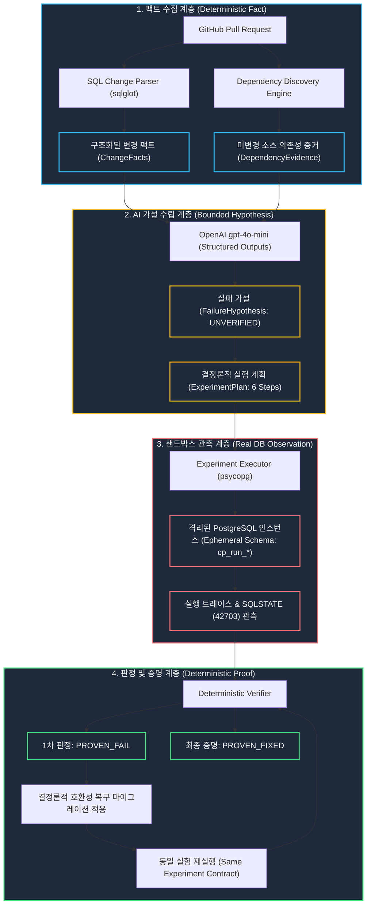

# ChangeProof — 시스템 아키텍처 및 신뢰 경계 (Architecture & Trust Model)

ChangeProof는 특정 변경으로 발생 가능한 실패를 재현하고 수정 후 동일 실험에서 실패가 사라졌는지 검증하기 위해 **결정론적 팩트 분석**, **증거 기반 AI 가설 수립**, **격리된 PostgreSQL 샌드박스 관측**, **결정론적 판정 불변식 검증**의 4단계 신뢰 계층을 결합합니다.

---

## 1. 종합 데이터 파이프라인 (Data & Trust Flow)



---

## 2. 4단계 신뢰 계층 (The 4-Layer Trust Model)

| 계층 (Layer) | 담당 컴포넌트 | 신뢰 수준 및 역할 (Role & Trust Boundary) | 핵심 출력 (Output) |
| :--- | :--- | :--- | :--- |
| **1. FACT (사실)** | SQL Parser, Dependency Finder | **100% 결정론적**. 저장소와 PR 커밋(`head_sha`)의 실제 코드만을 인덱싱하여 파싱. 추측 없음. | `ChangeFact`, `DependencyEvidence` |
| **2. HYPOTHESIS (가설)** | OpenAI Structured Outputs | **격리된 보조 추론**. 변경 팩트와 증거만을 입력으로 받아 구체적 결함 증상과 실험 템플릿 매핑. 안전성 판정 금지. | `FailureHypothesis` (상태: `UNVERIFIED`) |
| **3. OBSERVATION (관측)** | Ephemeral PostgreSQL Sandbox | **실제 DB 런타임**. 격리된 스키마에서 실제 마이그레이션과 쿼리를 실행하여 PostgreSQL 엔진의 물리적 오류 포착. | `SQLSTATE: 42703`, Step Result |
| **4. VERDICT & PROOF (판정/증명)** | Deterministic Verifier | **결정론적 불변식 검증**. 관측된 SQLSTATE와 실험 계약 다이제스트의 일치 여부를 대조해 판정. 동일 실험 재실행에서 관찰된 실패가 사라졌는지 검증. | `PROVEN_FAIL`, `PROVEN_FIXED` |

---

## 3. 핵심 안전 및 보안 아키텍처 (Safety & Security Architecture)

### A. AI 위험의 verdict 영향 제한 (Prompt Injection Isolation)
* 사용자가 제출한 GitHub 저장소의 소스코드, 커밋 메시지, 주석, SQL 파일은 **절대 시스템 명령으로 취급되지 않는 비신뢰 데이터(Untrusted Data)**로 격리됩니다.
* Pydantic 기반의 **Structured Outputs**를 강제하여, LLM은 정해진 스키마 형태의 JSON만을 반환할 수 있습니다.
* AI를 가설 제안자로 제한하고 사실·실행·판정을 결정론적 컴포넌트로 분리하여, 환각과 프롬프트 인젝션이 최종 verdict에 미치는 영향을 구조적으로 제한합니다.
* LLM이 반환한 임의의 SQL 문장이나 셸 스크립트는 실행 경로에 연결되지 않습니다.

### B. 격리된 PostgreSQL 샌드박스 (Sandbox Isolation)
* 매 실험마다 암호학적으로 안전한 12자리 헥사 네임스페이스(`cp_run_<hex12>`) 스키마를 생성합니다.
* 마이그레이션 및 쿼리 실행 시 `SET search_path`를 해당 임시 스키마로 강제 바인딩하여 타 테스트와의 간섭을 원천 차단합니다.
* **리소스 가드레일**:
  * 문장별 실행 타임아웃: `statement_timeout = 10000` (10초)
  * 락 획득 타임아웃: `lock_timeout = 5000` (5초)
  * 실험 완료/실패 여부와 관계없이 Python `finally` 블록에서 `DROP SCHEMA ... CASCADE`를 수행하고 cleanup 결과를 별도로 기록합니다.

### C. 계약 다이제스트 기반 동일 실험 증명 (Contract Digest Proof)
* 수정 검증의 핵심은 **"문제가 발생했던 바로 그 실험"**을 다시 수행하는 것입니다.
* ChangeProof는 실험 계획의 모든 SQL 단계, 베이스라인, 시드 데이터를 SHA-256으로 해싱하여 고유한 `experiment_contract_digest`를 생성합니다.
* 복구 후 검증 시:
  1. `experiment_contract_digest`가 1차 실험과 100% 동일함을 검증 (동일 실험 보장)
  2. 마이그레이션 대상 파일의 `subject_digest`가 변경되었음을 검증 (복구 패치 적용 보장)
  3. 1차 관측이 `PROVEN_FAIL`이고 2차 관측이 `PROVEN_PASS`일 때만 최종 `PROVEN_FIXED` 판정을 발급합니다.

```text
DETERMINISTIC ANALYSIS = FACT
OPENAI = HYPOTHESIS
POSTGRESQL = OBSERVATION
DETERMINISTIC VERIFIER = VERDICT

SAME EXPERIMENT
- CHANGED SUBJECT
- FAIL → PASS
= PROOF
```

> This proof applies to this controlled experiment, not to the entire pull request or production system.
