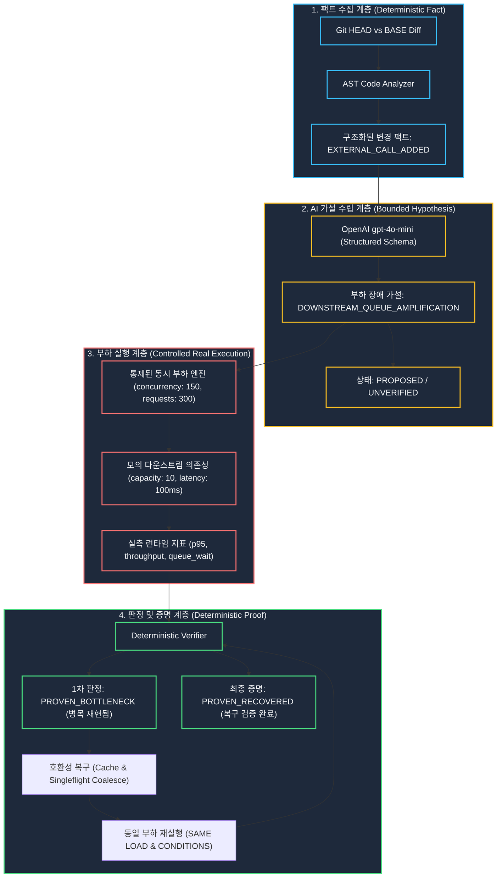

# ChangeProof — 시스템 아키텍처 및 신뢰 모델 (Architecture & Trust Model)

ChangeProof는 코드 변경으로 발생할 수 있는 프로덕션 부하 장애(Production Load Failure)를 통제된 개발 환경에서 재현하고, 수정 후 동일 부하 실험에서 관찰된 병목이 사라졌는지 확인하기 위해 **결정론적 팩트 분석**, **경계가 지정된 AI 가설 수립**, **통제된 동시 부하 실행**, **결정론적 판정 엔진**의 4단계 신뢰 계층을 결합합니다.

---

## 1. 종합 데이터 및 신뢰 파이프라인 (Data & Trust Flow)



---

## 2. 4단계 신뢰 계층 (The 4-Layer Trust Model)

### 계층 1: 결정론적 팩트 분석 (Deterministic Fact Layer)
- Git 커밋 간 차이점(HEAD vs BASE)과 AST 구문 분석을 통해 요청 경로에 새로 추가된 외부 의존성(`weather_client.get_current()`)을 객관적 사실(Fact)로 추출합니다.
- 이 단계는 AI 추론을 사용하지 않으며, 같은 입력에서 같은 결과를 내고 근거를 직접 검사할 수 있습니다.

### 계층 2: 경계가 지정된 AI 가설 수립 (Bounded AI Reasoning)
- **Why AI?**: k6나 JMeter 같은 기존 도구는 부하를 실행하는 훌륭한 러너이지만, *"이번 코드 변경 때문에 어떤 부하 테스트를 새로 설계해야 하는가?"*라는 질문을 해결하지 못합니다.
- ChangeProof의 AI는 추출된 변경 팩트를 바탕으로 *"사용자가 몰릴 경우 외부 API 대기열이 포화되어 전체 서비스가 지연될 수 있다"*는 가설과 시나리오 유형을 제안합니다.
- **핵심 불변식**: AI의 제안은 철저히 `PROPOSED / UNVERIFIED` 상태로 격리되며, AI 스스로 장애를 확정하거나 판정하지 않습니다.

### 계층 3: 통제된 실제 부하 실행 (Controlled Execution Layer)
- 모의 시뮬레이션이나 가짜 수치가 아닌, 실제 비동기 동시성(150 concurrency, 300 requests)을 인가하여 대상 엔드포인트를 호출합니다.
- 다운스트림의 용량(capacity: 10)과 지연시간(100ms)에 따라 실시간 큐잉이 형성되고 대기열 증폭이 런타임에 실측됩니다.

### 계층 4: 결정론적 판정 및 복구 증명 (Deterministic Proof Layer)
- 수학적 임계치(p95 latency threshold, downstream queue wait > 0)에 의해 시스템이 자동으로 `PROVEN_BOTTLENECK`을 판정합니다.
- 복구 코드(캐시 및 중복 호출 병합) 적용 후, 동일한 부하 계약(`SAME LOAD`, `SAME CONDITIONS`, `CHANGED SUBJECT`)을 재실행합니다. 대표 production 관측에서 p95 `1ms`, 큐 대기 `0ms`가 확인됐고 verifier가 해당 통제 실험에 대해 `PROVEN_RECOVERED`를 발행했습니다.

```text
DETERMINISTIC CHANGE ANALYSIS = FACT
OPENAI = HYPOTHESIS
CONTROLLED LOAD RUNNER = OBSERVATION
DETERMINISTIC VERIFIER = VERDICT
```

> 이 결과는 해당 통제 부하 실험에서 확인된 병목과 복구에 적용되며, 실제 운영 환경 전체의 성능을 보장하지 않습니다.

---

## 3. 엔터프라이즈 로컬 러너 아키텍처 (Privacy & Security)

공개 웹 데모는 안전하게 격리된 서버 소유 픽스처(server-owned fixture)를 사용하며, 기업 환경에서는 ChangeProof Runner를 사내망에 배치하여 비공개 저장소를 안전하게 검증합니다:

```text
Developer
    ↓
Local Git / Private Repo (사내망 보존)
    ↓
ChangeProof Runner (CLI)
    ↓
Dev/Test Environment (내부 스테이징 부하 실행)
    ↓
Measured Result (결정론적 병목 검증 보고서)
```

- Local Runner는 local Git과 사설망 dev/test target을 사용하도록 설계되어 raw source를 public GitHub에 공개할 필요가 없습니다.
- 기본 target 정책은 localhost와 RFC1918 사설망 개발 환경만 허용하며 임의 public target을 거부합니다.

---

## 4. 릴리즈 동결 기준 SHA

- **New Wanted Performance RC**: `7807251bf46bd4b309871ac7c9993c2a6155dd10`
- **Previous Rollback RC**: `a8fda49e880df1ec71fc0ba1d3fc1c8bcc2667ae`
- **Release Freeze**: `ACTIVE`
